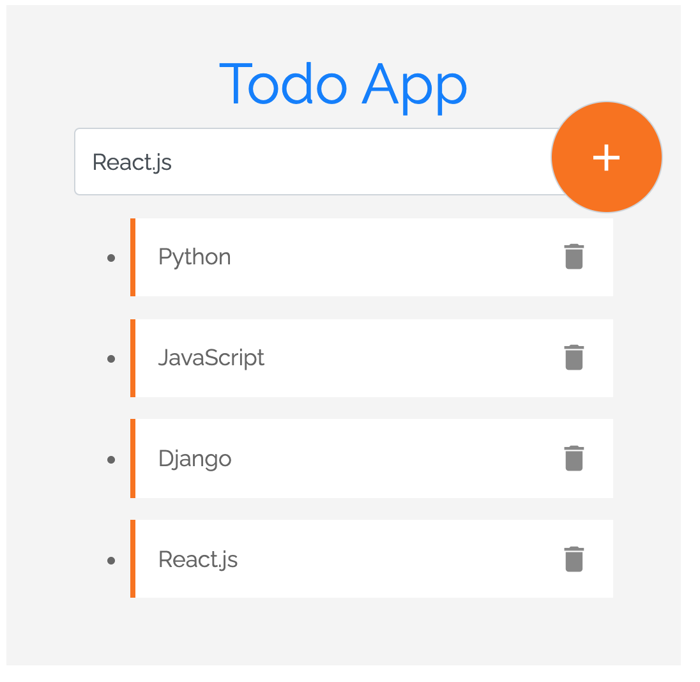

# TodoApp

Simple Todo App built while understanding the Angular Architecture so that I can add a feature to a codebase (work).

## Development server

Run `npm install` to install dependencies of app.

Run `ng serve` for a dev server. Navigate to `http://localhost:4200/`. The app will automatically reload if you change any of the source files.
